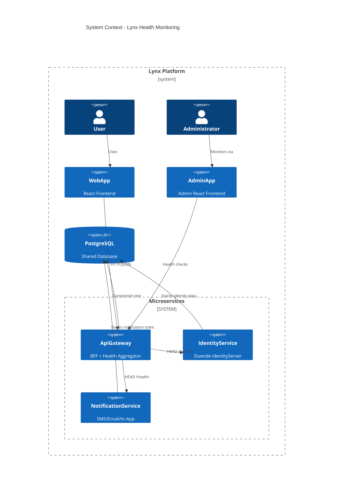
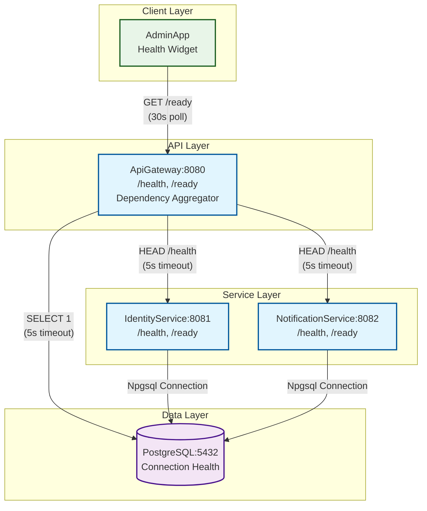

# Design — Bootstrap Environment and Health Checks

**What:**  
Add liveness (`/health`) and readiness (`/ready`) endpoints across all services (ApiGateway, IdentityService, NotificationService) with dependency aggregation in ApiGateway and a minimal health status widget in AdminApp.

**Why:**  
- Establishes baseline monitoring infrastructure for docker-compose and Hostinger VPS deployment
- Enables container orchestration readiness probes and early failure detection
- Provides operational visibility into service health and dependencies
- Foundation for future monitoring, alerting, and service mesh integration

**How:**  

### Architecture Choices
- **Liveness vs Readiness**: Liveness checks service process health; readiness checks dependency availability
- **Aggregation Pattern**: ApiGateway aggregates downstream readiness for circuit breaker behavior
- **Fail-Fast Design**: Non-ready services immediately surface dependency issues
- **Structured Logging**: All health checks use scoped logging with service/dependency context

### Endpoints & Contracts

**All Services (ApiGateway, IdentityService, NotificationService):**
- `GET /health` → `200 OK` (liveness - process is alive)
- `GET /ready` → `200 OK` or `503 Service Unavailable` (readiness - dependencies available)

**ApiGateway Readiness Aggregation:**
- HTTP `HEAD /health` checks to IdentityService (port 8081) and NotificationService (port 8082)
- Npgsql connection test to PostgreSQL (port 5432)
- Returns `200 OK` only if ALL dependencies are healthy
- Returns `503 Service Unavailable` with JSON error details if any dependency fails

**Response Format:**
```json
{
  "status": "Healthy|Degraded|Unhealthy",
  "timestamp": "2025-08-15T10:30:00Z",
  "dependencies": {
    "identityService": "Healthy|Unhealthy",
    "notificationService": "Healthy|Unhealthy", 
    "postgresql": "Healthy|Unhealthy"
  }
}
```

### Implementation Details

**Logging Scopes & Error Surfaces:**
- `log.BeginScope("HealthCheck:{Service}", serviceName)` for each check
- `log.BeginScope("DependencyCheck:{Dependency}", dependencyName)` for ApiGateway aggregation
- Log structured data: `{Service, Dependency, ResponseTime, Status, Error}`
- Error classification: `ConnectionFailure`, `TimeoutError`, `UnexpectedResponse`

**HTTP Client Configuration:**
- Timeout: 5 seconds for dependency checks
- No retries (health checks should be fast/fail-fast)
- Use typed HttpClient pattern with `IHttpClientFactory`

**PostgreSQL Health Check:**
```csharp
await using var connection = new NpgsqlConnection(connectionString);
await connection.OpenAsync(cancellationToken);
await connection.QuerySingleAsync<int>("SELECT 1", cancellationToken: cancellationToken);
```

**AdminApp Status Widget:**
- Simple React component with 3 states: 🟢 Healthy / 🟡 Degraded / 🔴 Unhealthy
- Polls ApiGateway `/ready` endpoint every 30 seconds
- Green: All systems operational
- Amber: Some dependencies degraded but core functionality available
- Red: Critical dependencies down

### Rollout Plan
1. Implement `/health` endpoints in all services (no dependencies)
2. Add PostgreSQL connectivity checks to individual services
3. Implement ApiGateway dependency aggregation `/ready`
4. Add AdminApp health status widget
5. Update docker-compose.yml with healthcheck configurations

### Risks & Mitigations
- **Risk**: Cascading failures if health checks overload dependencies
  - **Mitigation**: 5-second timeouts, no retries, HEAD requests where possible
- **Risk**: False positives during deployment/startup
  - **Mitigation**: Separate liveness (always up if process running) from readiness (dependencies ready)

**Tests:**  

### ApiGateway Health Tests
- `ApiGateway_Health_Returns200_WhenServiceIsRunning()`
- `ApiGateway_Ready_Returns200_WhenAllDependenciesHealthy()`
- `ApiGateway_Ready_Returns503_WhenIdentityServiceDown()`
- `ApiGateway_Ready_Returns503_WhenNotificationServiceDown()`
- `ApiGateway_Ready_Returns503_WhenPostgreSQLDown()`
- `ApiGateway_Ready_Returns503_WhenMultipleDependenciesDown()`
- `ApiGateway_Ready_LogsStructuredData_OnDependencyFailure()`

### IdentityService Health Tests  
- `IdentityService_Health_Returns200_WhenServiceIsRunning()`
- `IdentityService_Ready_Returns200_WhenPostgreSQLConnected()`
- `IdentityService_Ready_Returns503_WhenPostgreSQLDown()`
- `IdentityService_Ready_LogsConnectionFailure_WhenDatabaseUnavailable()`

### NotificationService Health Tests
- `NotificationService_Health_Returns200_WhenServiceIsRunning()`
- `NotificationService_Ready_Returns200_WhenPostgreSQLConnected()`
- `NotificationService_Ready_Returns503_WhenPostgreSQLDown()`
- `NotificationService_Ready_LogsConnectionFailure_WhenDatabaseUnavailable()`

### HTTP Handler Test Pattern
All tests use `MockHttpMessageHandler` with `NSubstitute`:
```csharp
[Test, AutoData]
public async Task ApiGateway_Ready_Returns503_WhenIdentityServiceDown(
    [Frozen] MockHttpMessageHandler mockHandler,
    [Frozen] ILogger<HealthController> logger,
    HealthController sut)
{
    // Arrange
    mockHandler.Setup(HttpMethod.Head, "http://localhost:8081/health")
              .ReturnsResponse(HttpStatusCode.ServiceUnavailable);
    
    // Act & Assert
    var result = await sut.ReadyAsync(CancellationToken.None);
    result.StatusCode.Should().Be(503);
}
```

### AdminApp Widget Tests
- `HealthWidget_ShowsGreen_WhenApiGatewayReturns200()`
- `HealthWidget_ShowsRed_WhenApiGatewayReturns503()`
- `HealthWidget_ShowsAmber_WhenApiGatewayTimeout()`
- `HealthWidget_PollsEvery30Seconds_WhenMounted()`

---

## Mermaid Diagrams

### Context


### Container

