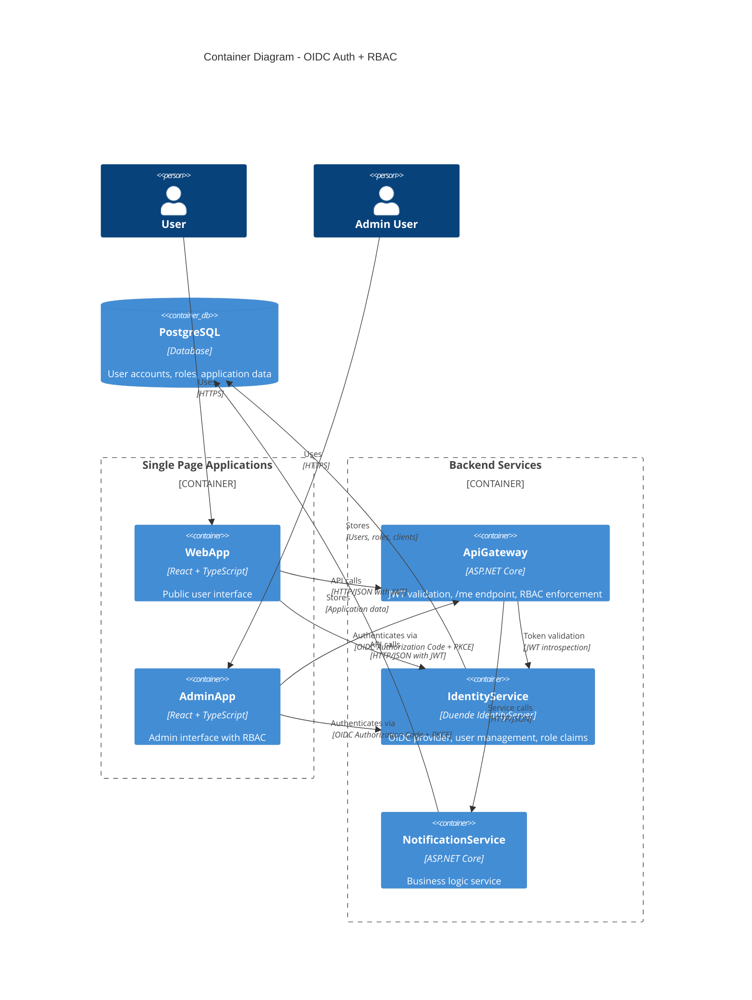
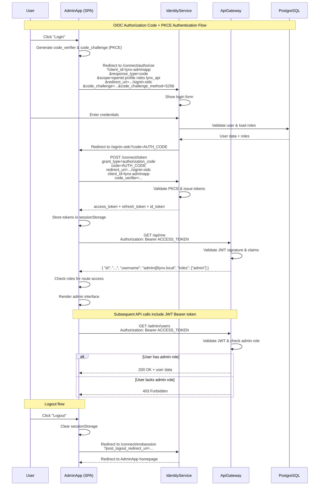

# Design — OIDC Auth + RBAC (Admin) through IdentityService

**What:**  
Implement OpenID Connect authentication with Authorization Code + PKCE flow for WebApp and AdminApp, plus role-based access control enforcing admin-only access to /admin/* routes through ApiGateway JWT validation.

**Why:**  
Establishes secure, standards-based authentication foundation and admin-only access controls required for all future features. Provides proper separation between public user features and administrative functionality while maintaining security best practices with no client secrets and proper CORS configuration.

**How:**

### IdentityService Configuration
- **SPA Client Configuration:**
  - Register two OIDC clients: `lynx-webapp` and `lynx-adminapp`
  - Redirect URIs: `http://localhost:3000/signin-oidc`, `http://localhost:3001/signin-oidc` (dev), `https://app.lynx.com/signin-oidc`, `https://admin.lynx.com/signin-oidc` (prod)
  - Post-logout URIs: `http://localhost:3000`, `http://localhost:3001` (dev), `https://app.lynx.com`, `https://admin.lynx.com` (prod)
  - Grant types: `authorization_code`, `refresh_token`
  - Response types: `code`
  - PKCE required: `true`
  - Client secrets: None (public clients)
  - Scopes: `openid`, `profile`, `roles`, `lynx_api`
- **CORS Policy:**
  - Allow origins: `http://localhost:3000`, `http://localhost:3001` (dev), `https://app.lynx.com`, `https://admin.lynx.com` (prod)
  - Allow credentials: `true`
  - Allow headers: `Content-Type`, `Authorization`
- **Role Claims Issuance:**
  - Configure custom claims transformation to include `role` claim in access tokens
  - Map ASP.NET Identity roles to OIDC `role` claim
- **Seed Admin User:**
  - Username: `admin@lynx.local`
  - Password: `Admin123!` (configurable via environment variable)
  - Role: `admin`
  - Auto-create during IdentityService startup if not exists

### ApiGateway JWT Authentication
- **JWT Bearer Authentication:**
  - Configure JWT validation with IdentityService as authority
  - Validate issuer, audience, signature, and expiration
  - Map `role` claim to ClaimsPrincipal roles
- **Authorization Policies:**
  - Create `AdminPolicy` requiring `role=admin` claim
  - Apply `[Authorize(Policy = "AdminPolicy")]` to all `/admin/*` controllers/actions
  - Return 401 for invalid/missing tokens, 403 for insufficient roles
- **/me Endpoint:**
  - Route: `GET /api/me`
  - Returns: `{ "id": "guid", "username": "string", "roles": ["string"] }`
  - Requires valid access token
  - Maps from ClaimsPrincipal to user info DTO

### WebApp/AdminApp OIDC Integration
- **OIDC Configuration:**
  - Library: `oidc-client-ts` for TypeScript support
  - Authority: `http://localhost:8081` (dev), `https://identity.lynx.com` (prod)
  - Client IDs: `lynx-webapp`, `lynx-adminapp`
  - Redirect URI: `/signin-oidc`
  - Post-logout redirect: `/`
  - Response type: `code`
  - Scope: `openid profile roles lynx_api`
  - PKCE: enabled
- **Login/Logout Flows:**
  - Login button redirects to IdentityService `/connect/authorize`
  - Handle callback at `/signin-oidc` route
  - Store tokens in `sessionStorage` (not localStorage for security)
  - Logout clears tokens and redirects to IdentityService `/connect/endsession`
- **Token Management:**
  - Automatic token refresh using refresh tokens
  - Include `Authorization: Bearer {access_token}` header in all API calls
  - Clear tokens on 401 responses and redirect to login
- **Route Guards:**
  - AdminApp: Check for valid token and `admin` role before rendering /admin routes
  - Show 403 error page for authenticated but unauthorized users
  - Redirect to login for unauthenticated users

### Security Considerations
- **No Client Secrets:** SPAs are public clients, rely on PKCE for security
- **CORS Configuration:** Strict origin validation, no wildcards in production
- **HTTPS Enforcement:** All production traffic over TLS
- **Token Storage:** sessionStorage only, automatic cleanup on tab close
- **CSP Headers:** Restrict script sources and inline execution

### Rollout Plan
1. Configure IdentityService with Duende IdentityServer Community Edition
2. Implement ApiGateway JWT validation and /me endpoint
3. Add AdminApp OIDC integration with route guards
4. Add WebApp OIDC integration (prepare for future user features)
5. Deploy with proper HTTPS and CORS configuration

### Risks & Mitigations
- **Risk:** OIDC configuration complexity
  - **Mitigation:** Use well-tested libraries (oidc-client-ts, ASP.NET JWT middleware)
- **Risk:** Token refresh failures leading to poor UX
  - **Mitigation:** Implement automatic refresh with fallback to re-authentication
- **Risk:** CORS misconfigurations blocking legitimate requests
  - **Mitigation:** Comprehensive testing across development and production origins

**Tests:**

### Unit Tests (ApiGateway)
- `JwtAuthenticationMiddleware_ValidToken_SetsClaimsPrincipal`
- `JwtAuthenticationMiddleware_ExpiredToken_Returns401`
- `JwtAuthenticationMiddleware_InvalidSignature_Returns401`
- `JwtAuthenticationMiddleware_MissingToken_Returns401`
- `AdminAuthorizationPolicy_UserWithAdminRole_AllowsAccess`
- `AdminAuthorizationPolicy_UserWithoutAdminRole_Returns403`
- `AdminAuthorizationPolicy_UnauthenticatedUser_Returns401`
- `MeEndpoint_ValidToken_ReturnsUserInfo`
- `MeEndpoint_ValidToken_ReturnsUserRoles`
- `MeEndpoint_InvalidToken_Returns401`
- `MeEndpoint_MissingClaims_ReturnsEmptyRoles`

### Integration Tests
- **IdentityService:** OIDC discovery endpoint returns correct configuration
- **E2E Flow:** Complete login flow from AdminApp through IdentityService to ApiGateway
- **Token Validation:** ApiGateway correctly validates tokens issued by IdentityService

### UI Guard Tests (Minimal)
- AdminApp login button redirects to IdentityService
- AdminApp shows 403 page for non-admin users
- AdminApp clears tokens and redirects on logout
- WebApp handles authentication state correctly

---
## Mermaid Diagrams

### Container Architecture

### OIDC Authorization Code + PKCE Flow

