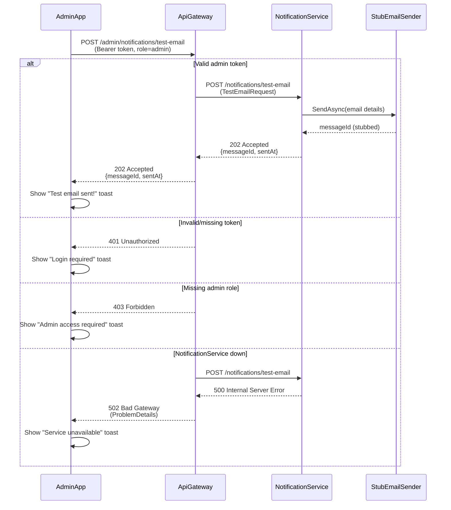
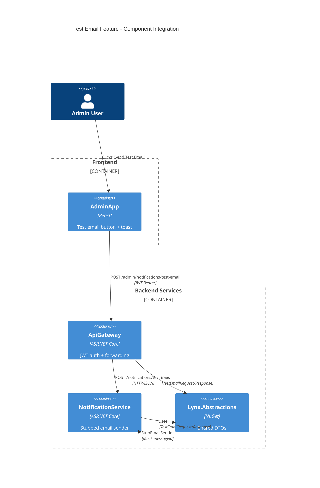

# Design — Test Email via NotificationService

**What:**  
Implement end-to-end test email functionality with POST /admin/notifications/test-email in ApiGateway forwarding to NotificationService, plus AdminApp UI integration and shared DTOs for admin smoke testing.

**Why:**  
Verify the notification path early to de-risk future SMS/In-App work and provide a simple admin smoke test for environment readiness without external dependencies.

**How:**  

### Shared DTOs in `src/Lynx.Abstractions/Notifications/`
```csharp
public sealed record TestEmailRequest
{
    public required string To { get; init; }
    public required string Subject { get; init; }
    public required string Body { get; init; }
}

public sealed record TestEmailResponse
{
    public required string MessageId { get; init; }
    public DateTime SentAt { get; init; } = DateTime.UtcNow;
}
```

### ApiGateway Implementation
- **Endpoint**: `POST /admin/notifications/test-email`
- **Authorization**: JWT Bearer with `role=admin` requirement
- **Behavior**: 
  - Validate JWT and admin role (401/403 for failures)
  - Forward request to NotificationService via typed HttpClient
  - Map responses: 202 success, 502 when downstream fails
  - Use ProblemDetails for error responses
  - Logging with scopes for traceability

### NotificationService Implementation  
- **Endpoint**: `POST /notifications/test-email`
- **Behavior**:
  - Accept TestEmailRequest payload
  - Use stubbed IEmailSender (no external calls)
  - Generate mock MessageId (Guid.NewGuid())
  - Return 202 Accepted with TestEmailResponse
  - Validate payload and return 400 for invalid requests
  - Structured logging with correlation

### AdminApp Integration
- **UI**: Simple "Send Test Email" button in admin section
- **Flow**: 
  - Button click → POST to ApiGateway with Bearer token
  - Show loading state during request
  - Display toast notification: "Test email sent!" or error message
  - Handle 401/403/502 with appropriate user messaging

### Logging & Monitoring
- ApiGateway: Scope with admin user ID and correlation ID
- NotificationService: Scope with message ID and email details
- ProblemDetails for structured error responses

### Rollout Plan
1. Add shared DTOs to Lynx.Abstractions
2. Implement NotificationService endpoint with stubbed sender
3. Add ApiGateway admin endpoint with forwarding
4. Create AdminApp UI with toast notifications
5. Deploy and test end-to-end flow

### Risks & Mitigations
- **Risk**: Service communication failure
  - **Mitigation**: Proper 502 handling and ProblemDetails surfacing
- **Risk**: Authorization bypass
  - **Mitigation**: Explicit role=admin requirement with unit tests
- **Risk**: Scope creep to real email providers
  - **Mitigation**: Explicit stub-only implementation with clear interfaces

**Tests:**  

### ApiGateway Unit Tests
**File**: `tests/ApiGateway.UnitTests/Notifications/TestEmailTests.cs`
- `TestEmail_WithoutToken_Returns401()`
- `TestEmail_WithoutAdminRole_Returns403()`
- `TestEmail_WithAdminRole_ForwardsToNotificationService()`
- `TestEmail_WhenDownstreamReturns202_Returns202WithResponse()`
- `TestEmail_WhenDownstreamFails_Returns502WithProblemDetails()`
- `TestEmail_WithInvalidPayload_Returns400()`
- `TestEmail_LogsWithProperScopes()`

### NotificationService Unit Tests
**File**: `tests/NotificationService.UnitTests/Notifications/TestEmailEndpointTests.cs`
- `TestEmail_WithValidPayload_Returns202WithMessageId()`
- `TestEmail_WithInvalidPayload_Returns400()`
- `TestEmail_WithStubSender_GeneratesMessageId()`
- `TestEmail_LogsEmailDetails()`
- `TestEmail_ValidatesEmailFormat()`

### HTTP Mocking Strategy
- Use `HttpMessageHandler` mocking for ApiGateway → NotificationService calls
- Mock `IEmailSender` interface with NSubstitute for NotificationService tests
- No real HTTP calls in unit tests

---
## Mermaid Diagrams

### Test Email Flow Sequence


### Component Integration

