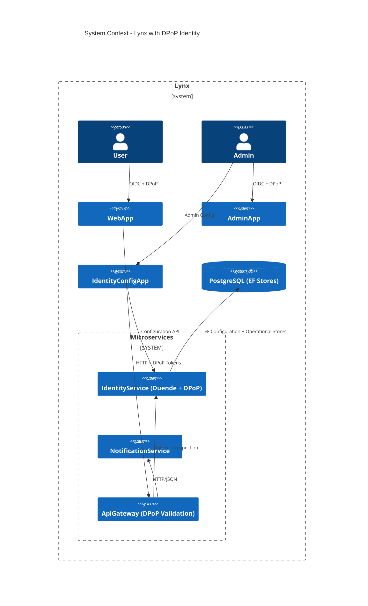
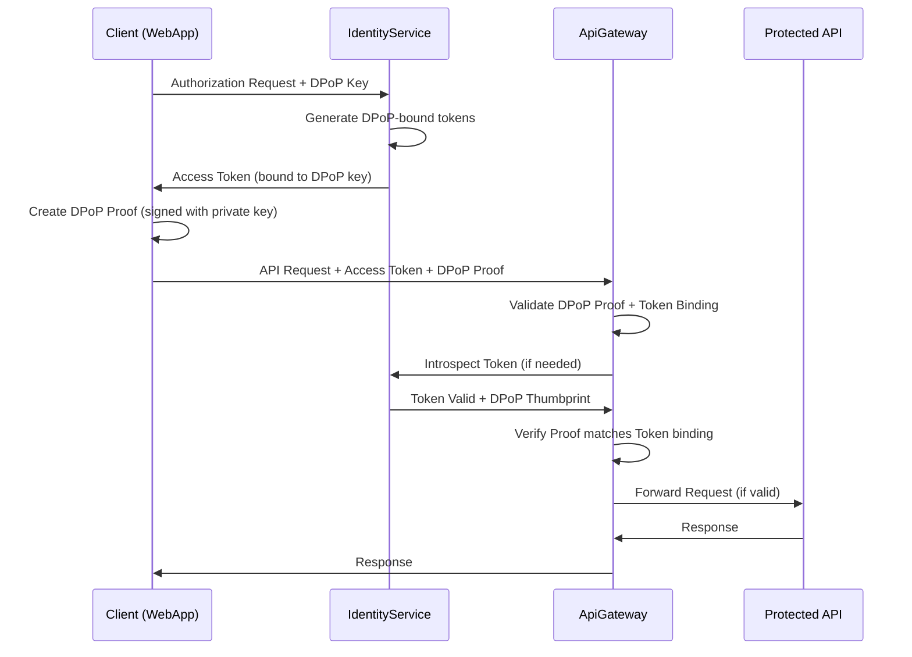
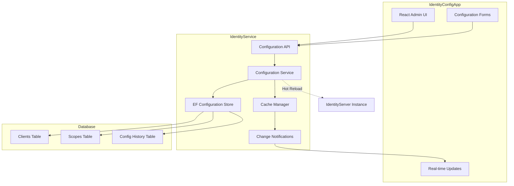
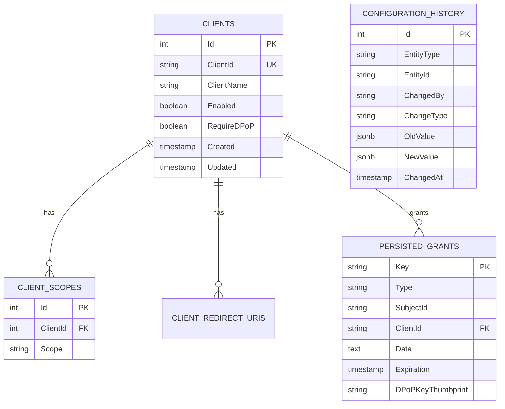

# Design — Production-Ready Identity Microservice

**What:**  
Upgrade Lynx IdentityService from in-memory stores to production-ready EF Core persistent storage, add DPoP token security, configuration management, and administrative web interface.

**Why:**  
Current implementation has critical production limitations: in-memory stores lose data on restart, hardcoded configuration prevents horizontal scaling, lacks modern DPoP token binding security, and has no operational configuration management. This architectural upgrade enables production deployment, horizontal scaling, enhanced security, and runtime administration.

**How:**

## Architecture Choices

### 1. EF Core Persistent Stores

- **Duende IdentityServer.EntityFramework**: Use official EF package for configuration and operational stores
- **Store Implementation**: Replace `AddInMemory*` with `AddConfigurationStore<T>` and `AddOperationalStore<T>`
- **Database Strategy**: Extend existing PostgreSQL `lynx_identity` database with IdentityServer tables
- **Migration Strategy**: Blue-green deployment with data seeding for zero-downtime upgrade

### 2. DPoP (Demonstration of Proof-of-Possession) Integration

- **Token Binding**: Enable DPoP in IdentityServer to bind tokens to client-generated keys
- **Validation Pipeline**: Add DPoP proof validation middleware in ApiGateway
- **Client Support**: Maintain backward compatibility with Bearer tokens during transition
- **Security Model**: Prevent token theft/replay attacks via cryptographic binding

### 3. Configuration Management

- **Hybrid Approach**: Initial config from `appsettings.json`, runtime updates via database
- **Environment Separation**: Dev/staging/prod-specific client configurations
- **Hot Reload**: Configuration changes without service restart via EF change tracking
- **Versioning**: Track configuration changes for audit and rollback

### 4. Identity Configuration Web App

- **Technology**: React 18 + TypeScript + Vite (consistent with WebApp/AdminApp)
- **Authentication**: OIDC integration with IdentityService, `admin` role requirement
- **API**: RESTful configuration endpoints on IdentityService
- **Real-time**: WebSocket notifications for configuration changes

## Contracts & Endpoints

### IdentityService Configuration API
```typescript
// DTOs
interface ClientDto {
  id: string;
  clientName: string;
  allowedGrantTypes: string[];
  redirectUris: string[];
  allowedScopes: string[];
  requireDPoP?: boolean;
}

interface ApiScopeDto {
  name: string;
  displayName: string;
  description?: string;
  required: boolean;
}

// Endpoints
GET    /api/config/clients
POST   /api/config/clients
PUT    /api/config/clients/{id}
DELETE /api/config/clients/{id}

GET    /api/config/scopes
POST   /api/config/scopes
PUT    /api/config/scopes/{name}
DELETE /api/config/scopes/{name}
```

### DPoP Token Validation
```csharp
// ApiGateway Middleware
public class DPoPValidationMiddleware
{
    public async Task InvokeAsync(HttpContext context, ITokenValidator validator)
    {
        var token = context.Request.Headers.Authorization.FirstOrDefault()?.Split(" ").Last();
        var dpopProof = context.Request.Headers["DPoP"].FirstOrDefault();
        
        var result = await validator.ValidateTokenAsync(token, dpopProof);
        // Set claims and continue pipeline
    }
}
```

## Data Model Changes

### IdentityServer EF Stores
```sql
-- Configuration Store Tables (from Duende package)
CREATE TABLE Clients (
    Id SERIAL PRIMARY KEY,
    Enabled BOOLEAN NOT NULL,
    ClientId VARCHAR(200) NOT NULL,
    ClientName VARCHAR(200),
    RequireDPoP BOOLEAN DEFAULT FALSE,
    -- ... other Duende fields
);

CREATE TABLE ClientScopes (
    Id SERIAL PRIMARY KEY,
    Scope VARCHAR(200) NOT NULL,
    ClientId INTEGER NOT NULL,
    FOREIGN KEY (ClientId) REFERENCES Clients(Id)
);

-- Operational Store Tables (from Duende package)
CREATE TABLE PersistedGrants (
    Key VARCHAR(200) PRIMARY KEY,
    Type VARCHAR(50) NOT NULL,
    SubjectId VARCHAR(200),
    ClientId VARCHAR(200) NOT NULL,
    Data TEXT NOT NULL,
    Expiration TIMESTAMP,
    -- DPoP binding fields
    DPoPKeyThumbprint VARCHAR(100)
);
```

### Configuration Management Tables
```sql
-- Custom configuration tracking
CREATE TABLE ConfigurationHistory (
    Id SERIAL PRIMARY KEY,
    EntityType VARCHAR(50) NOT NULL, -- 'Client', 'Scope', etc.
    EntityId VARCHAR(200) NOT NULL,
    ChangedBy VARCHAR(100) NOT NULL,
    ChangeType VARCHAR(20) NOT NULL, -- 'Created', 'Updated', 'Deleted'
    OldValue JSONB,
    NewValue JSONB,
    ChangedAt TIMESTAMP DEFAULT NOW()
);
```

## Rollout Plan & Migration

### Phase 1: EF Core Stores
1. Add Duende EF packages and DbContexts
2. Run database migrations 
3. Seed existing in-memory data to database
4. Switch IdentityServer configuration to EF stores
5. Verify functionality with existing clients

### Phase 2: Configuration Management
1. Move hardcoded client configs to `appsettings.json`
2. Create configuration API endpoints
3. Implement configuration loading/reloading
4. Add configuration change tracking

### Phase 3: DPoP Implementation
1. Enable DPoP in IdentityServer configuration
2. Update client configurations for DPoP support
3. Implement DPoP validation in ApiGateway
4. Test end-to-end DPoP flow

### Phase 4: Admin Interface
1. Create IdentityConfigApp React project
2. Implement CRUD interfaces for configuration
3. Add authentication and authorization
4. Deploy alongside other web apps

### Deployment Strategy
- **Blue-Green**: Deploy new version alongside current, switch traffic after validation
- **Database Migration**: Use EF migrations with rollback capability
- **Configuration Seeding**: Automatic migration of current hardcoded configs
- **Health Checks**: Extended health checks for EF stores and DPoP validation

## Risks & Mitigations

### Risk: Data Loss During Migration
**Mitigation**: 
- Database backups before migration
- Configuration export/import tooling
- Rollback procedures documented
- Staging environment testing

### Risk: DPoP Client Compatibility
**Mitigation**:
- Gradual rollout with feature flags
- Maintain Bearer token support during transition
- Client SDK updates with DPoP support
- Clear migration documentation

### Risk: Performance Impact of EF Stores
**Mitigation**:
- Connection pooling and query optimization
- Caching for frequently accessed configuration
- Performance testing under load
- Database indexing strategy

### Risk: Configuration Corruption
**Mitigation**:
- Configuration validation at API level
- Change history tracking for auditing
- Configuration backup/restore functionality
- Read-only emergency mode

## Tests

### Unit Tests (xUnit + AutoFixture + NSubstitute + FluentAssertions)

#### EF Store Tests
```csharp
public class ClientStoreTests
{
    [Theory, AutoNSubstituteData]
    public async Task GetClientAsync_WithValidId_ReturnsClient(
        [Frozen] Mock<ApplicationDbContext> context,
        ClientStore sut,
        Client expectedClient)
    {
        // Arrange: Setup EF context mock
        // Act: Call GetClientAsync
        // Assert: Returns correct client
    }
    
    [Theory, AutoNSubstituteData]
    public async Task GetClientAsync_WithDPoPEnabled_ReturnsDPoPClient(
        ClientStore sut,
        string clientId)
    {
        // Test DPoP configuration loading
    }
}
```

#### Configuration API Tests
```csharp
public class ConfigurationControllerTests
{
    [Theory, AutoNSubstituteData]
    public async Task CreateClient_WithValidModel_ReturnsCreated(
        [Frozen] IClientConfigurationService service,
        ConfigurationController sut,
        ClientDto clientDto)
    {
        // Test client creation endpoint
    }
    
    [Theory, AutoNSubstituteData]
    public async Task UpdateClient_WithDPoPChange_InvalidatesCache(
        ConfigurationController sut,
        ClientDto clientDto)
    {
        // Test configuration cache invalidation
    }
}
```

#### DPoP Validation Tests
```csharp
public class DPoPValidationTests
{
    [Theory, AutoNSubstituteData]
    public async Task ValidateToken_WithValidDPoPProof_ReturnsSuccess(
        DPoPTokenValidator sut,
        string accessToken,
        string dpopProof)
    {
        // Test valid DPoP proof validation
    }
    
    [Theory, AutoNSubstituteData]
    public async Task ValidateToken_WithReplayedProof_ReturnsFailure(
        DPoPTokenValidator sut,
        string accessToken,
        string replayedProof)
    {
        // Test replay attack prevention
    }
}
```

### Integration Tests
```csharp
public class IdentityServiceIntegrationTests : IClassFixture<WebApplicationFactory<Program>>
{
    [Fact]
    public async Task TokenEndpoint_WithDPoPClient_IssuesBoundToken()
    {
        // End-to-end DPoP token issuance test
    }
    
    [Fact]
    public async Task ConfigurationEndpoint_RequiresAdminRole()
    {
        // Test admin-only access to configuration APIs
    }
}
```

### Contract Tests
- **API Contract Tests**: Verify configuration API responses match client expectations
- **Token Contract Tests**: Ensure DPoP tokens contain required claims and binding
- **Database Schema Tests**: Validate EF migrations produce expected schema

### Performance Tests
- **EF Store Performance**: Measure token validation performance vs in-memory
- **Configuration Loading**: Test configuration reload performance
- **DPoP Validation**: Benchmark DPoP proof validation overhead
- **Database Load**: Test under concurrent client token requests

---

## Mermaid Diagrams

### System Context with DPoP


### DPoP Token Flow


### Configuration Management Architecture


### Database Schema Overview


---

**Design Status**: ✅ Complete - Ready for implementation
**Next Phase**: Feature Branch Creation (`feature/11-production-identity`)
