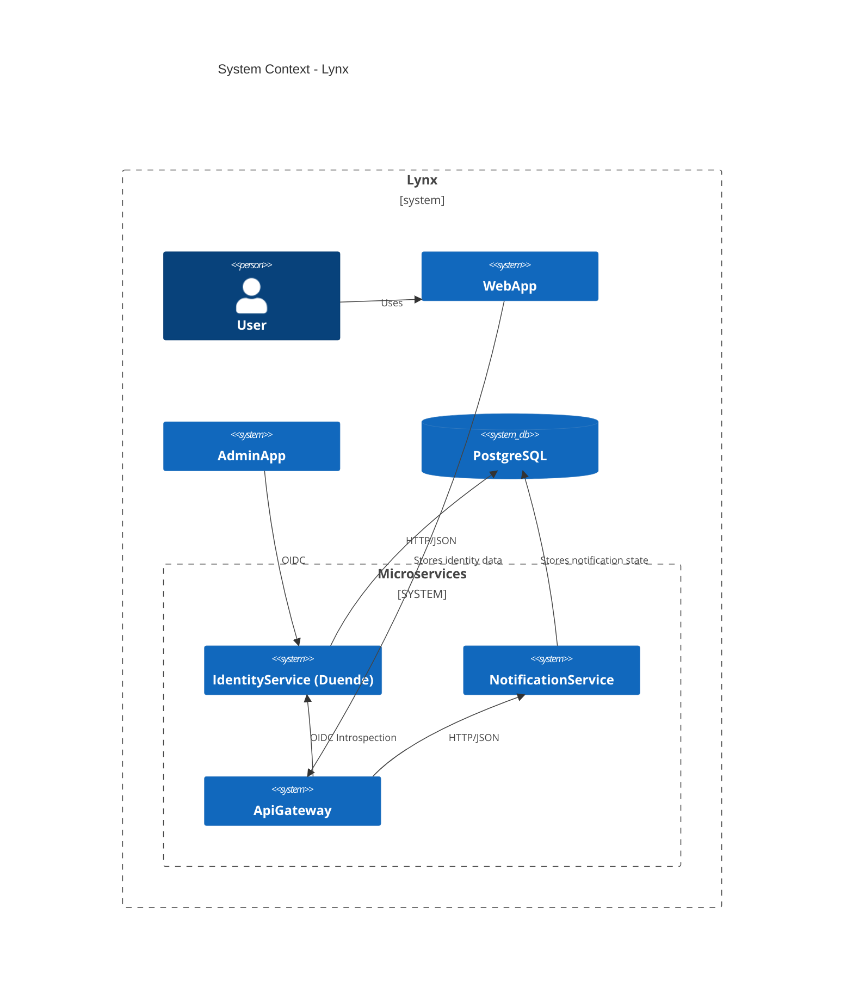
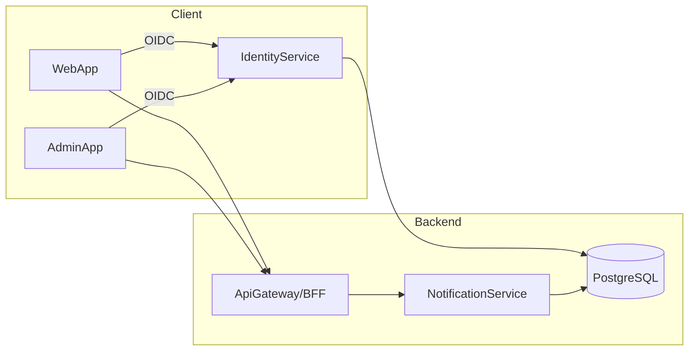

# Design — <Feature Name>

**What:**  
Describe the feature clearly in one or two sentences.

**Why:**  
Explain the business/technical value and constraints.

**How:**  
- Architecture choices
- Contracts (DTOs, endpoints)
- Data model changes (if any)
- Rollout plan / migration
- Risks & mitigations

**Tests:**  
- Unit test list (xUnit + AutoFixture + NSubstitute + FluentAssertions)
- Contract tests
- Performance checks (if relevant)

---
## Mermaid Diagrams (for architectural features)

### Context

### Container

